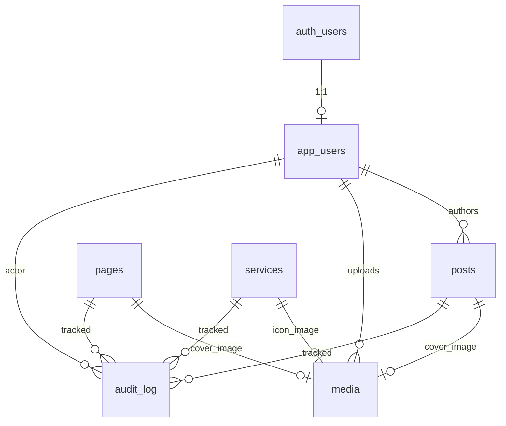

# Data Models

> Full schema in `docs/fullstack-architecture.md` §9. This file is the consumable summary for SDC.

## ER Diagram



## Enums

```sql
CREATE TYPE app_role        AS ENUM ('admin','editor','viewer');
CREATE TYPE content_status  AS ENUM ('draft','scheduled','published','archived');
CREATE TYPE audit_action    AS ENUM ('insert','update','delete');
```

## Tables

### app_users
| Column     | Type        | Notes                                     |
| ---------- | ----------- | ----------------------------------------- |
| id         | UUID PK     | FK auth.users(id) ON DELETE CASCADE       |
| email      | TEXT UNIQUE | NOT NULL                                  |
| name       | TEXT        |                                           |
| role       | app_role    | DEFAULT 'viewer'                          |
| active     | BOOLEAN     | DEFAULT true                              |
| created_at, updated_at | TIMESTAMPTZ | auto                          |

### media
| Column         | Type        | Notes                                |
| -------------- | ----------- | ------------------------------------ |
| id             | UUID PK     |                                      |
| storage_path   | TEXT UNIQUE | path no bucket `media`               |
| public_url     | TEXT        |                                      |
| alt            | TEXT        |                                      |
| mime           | TEXT        |                                      |
| width_px, height_px | INT    |                                      |
| size_bytes     | INT         |                                      |
| uploaded_by    | UUID FK app_users | ON DELETE SET NULL             |
| created_at     | TIMESTAMPTZ |                                      |

### posts
| Column          | Type                 | Notes                                  |
| --------------- | -------------------- | -------------------------------------- |
| id              | UUID PK              |                                        |
| slug            | TEXT UNIQUE          |                                        |
| title           | TEXT NOT NULL        |                                        |
| excerpt         | TEXT                 |                                        |
| body_md         | TEXT                 | markdown source                        |
| body_html       | TEXT                 | rendered HTML                          |
| category        | TEXT                 |                                        |
| tags            | TEXT[]               | DEFAULT '{}'                           |
| cover_image_id  | UUID FK media        | ON DELETE SET NULL                     |
| status          | content_status       | DEFAULT 'draft'                        |
| published_at    | TIMESTAMPTZ          |                                        |
| author_id       | UUID FK app_users    | ON DELETE SET NULL                     |
| created_at, updated_at | TIMESTAMPTZ   |                                        |

**Indexes:** `(slug)` unique, `(status, published_at DESC)`, `gin(tags)`, `(category, status)`.

### pages
| Column          | Type                 | Notes                                  |
| --------------- | -------------------- | -------------------------------------- |
| id              | UUID PK              |                                        |
| slug            | TEXT UNIQUE          |                                        |
| title           | TEXT NOT NULL        |                                        |
| body_md, body_html | TEXT              |                                        |
| meta            | JSONB                | DEFAULT '{}'; SEO key-values           |
| cover_image_id  | UUID FK media        |                                        |
| status          | content_status       |                                        |
| published_at    | TIMESTAMPTZ          |                                        |
| timestamps      |                      |                                        |

**Indexes:** `(slug)` unique, `(status, published_at DESC)`.

### services
| Column          | Type                 | Notes                                  |
| --------------- | -------------------- | -------------------------------------- |
| id              | UUID PK              |                                        |
| slug            | TEXT UNIQUE          |                                        |
| title           | TEXT NOT NULL        |                                        |
| summary         | TEXT                 |                                        |
| body_md, body_html | TEXT              |                                        |
| price_tier      | TEXT                 | enum-like (`starter|standard|premium`) |
| icon            | TEXT                 |                                        |
| order_index     | INT NOT NULL         | DEFAULT 100                            |
| status, published_at, timestamps |     |                                        |

**Indexes:** `(slug)` unique, `(order_index)`, `(status, published_at DESC)`.

### audit_log (PARTITIONED BY RANGE created_at, monthly)
| Column        | Type            | Notes                                |
| ------------- | --------------- | ------------------------------------ |
| id            | BIGINT IDENTITY | PK composto (id, created_at)         |
| actor_id      | UUID FK app_users | ON DELETE SET NULL                 |
| action        | audit_action    |                                      |
| entity_type   | TEXT            | `posts|pages|services|media|app_users` |
| entity_id     | UUID            |                                      |
| diff          | JSONB           | `{ before?, after? }`                |
| created_at    | TIMESTAMPTZ     | DEFAULT now()                        |

**Indexes:** `(entity_type, entity_id, created_at DESC)`, `(actor_id, created_at DESC)`, BRIN em `created_at`.

**Retention:** 13 meses (ADR-001). Cleanup via DROP partition (Phase 2 cron).

## RLS Summary

| Table       | Anon SELECT                                  | Authenticated CRUD                                     |
| ----------- | -------------------------------------------- | ------------------------------------------------------ |
| posts       | `status='published' AND published_at<=now()` | `current_user_can_write()` (admin/editor)              |
| pages       | same                                         | same                                                    |
| services    | same                                         | same                                                    |
| media       | always (public bucket)                       | same                                                    |
| app_users   | denied                                       | self read; admin full                                  |
| audit_log   | denied                                       | admin SELECT only (writes via trigger SECURITY DEFINER)|

## Helper Functions

- `current_user_can_write() RETURNS BOOLEAN` — checks `app_users.role IN ('admin','editor') AND active=true`.
- `current_user_is_admin() RETURNS BOOLEAN`.
- `fn_audit_log() RETURNS trigger SECURITY DEFINER` — universal audit trigger for INSERT/UPDATE/DELETE.
- `set_updated_at() RETURNS trigger` — sets `NEW.updated_at = now()`.

## Triggers

- `posts_audit`, `pages_audit`, `services_audit`, `media_audit`, `app_users_audit` → `fn_audit_log()`.
- `*_updated_at` → `set_updated_at()`.

## pg_cron Job (Story 4.2, ADR-004)

```sql
SELECT cron.schedule(
  'promote-scheduled-content',
  '* * * * *',
  $$
    UPDATE public.posts    SET status='published' WHERE status='scheduled' AND published_at<=now();
    UPDATE public.pages    SET status='published' WHERE status='scheduled' AND published_at<=now();
    UPDATE public.services SET status='published' WHERE status='scheduled' AND published_at<=now();
  $$
);
```

## Database Webhook (manual config — Story 4.6)

Configured via Supabase Dashboard (NOT versioned in `supabase/migrations`):
- **Trigger:** INSERT or UPDATE on `posts`, `pages`, `services` WHERE `status='published'`.
- **Target:** `https://olmedapetstudio.com/api/revalidate`
- **Headers:** `x-revalidate-token: <REVALIDATE_TOKEN>`
- **Payload:** `{ paths: ["/blog/<slug>", "/blog", "/sitemap.xml"] }` (table-specific paths assembled).
- **DR backup:** `.aiox/runbook/webhook-config.yaml`.
