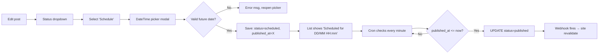

# Olmeda Pet Studio — UI/UX Specification (apps/admin)

**Status:** Draft v1 (Phase 1.3 — UX output)
**Date:** 2026-05-23
**Author:** @ux (Uma) — derived from `docs/prd.md`
**Scope:** `apps/admin` only. `apps/site` segue o design imutável em `/design` + `amandaalmeidda/olmeda-design-system`.

---

## 1. Introduction

Este documento define os objetivos de experiência do usuário, arquitetura de informação, fluxos, layouts e estilo visual para o app `admin.olmedapetstudio.com` (Olmeda Pet Studio CMS). É a base para a implementação frontend do CMS — fornecendo wireframes em ASCII, estados, padrões de interação e referência ao design system existente.

O site público (`olmedapetstudio.com`) está **fora do escopo** deste documento: ele consome o design em `/design` (HTML/CSS imutável, source-of-truth) e o package npm `amandaalmeidda/olmeda-design-system`. O admin reusa os mesmos tokens (cores, tipografia, espaçamento) para coesão visual, mas tem layouts e componentes próprios.

### 1.1 Overall UX Goals & Principles

#### Target User Personas

- **Owner (Amanda Almeida):** dona do negócio, role `admin`. Publica conteúdo ocasionalmente, gerencia editores. Não-técnica mas confortável com ferramentas modernas (Instagram, Notion, etc.). Português nativo.
- **Editor:** equipe interna de marketing/conteúdo (a contratar). Role `editor`. Foca em escrever posts. Não conhece markdown, slugs ou IDs; trabalha em desktop.
- **Viewer (futuro):** revisor convidado. Role `viewer`. Só lê — sem CRUD.

#### Usability Goals

- **First-time publish:** owner publica primeiro post sem assistência em ≤10 min (NFR9).
- **Recurring publish:** editor publica post completo (título + 500 palavras + 1 imagem + scheduling) em ≤5 min.
- **Error prevention:** ações destrutivas (delete, unpublish published) sempre confirmação modal.
- **Memorability:** após 1 mês sem usar, editor retoma sem tutorial.
- **Trust:** auto-save visível elimina ansiedade ("did it save?").

#### Design Principles

1. **Clarity over cleverness** — texto em PT-BR direto, sem jargão técnico ("slug", "metadata"). Labels falam o que o campo é, não o que é internamente.
2. **Status sempre visível** — todo conteúdo tem badge de status (Draft / Scheduled / Published / Archived) com cor consistente.
3. **Auto-save invisível, restore explícito** — salva sozinho, mas exibe `Saved 12s ago` discretamente. Restore version (futuro) é botão visível.
4. **Optimistic UI com graceful degradation** — UI assume sucesso; em erro mostra toast + revert. Não bloqueia o editor com spinners.
5. **Density without clutter** — listas densas (50 rows/página) com bom espaçamento vertical; sem cards inflados ou whitespace excessivo.
6. **Reuse the brand** — paleta, tipografia e radius vêm do design system Olmeda. Admin não inventa estética nova.

### 1.2 Change Log

| Date       | Version | Description                  | Author      |
| ---------- | ------- | ---------------------------- | ----------- |
| 2026-05-23 | 1.0     | Initial UX spec draft        | @ux (Uma)   |

---

## 2. Information Architecture (IA)

### 2.1 Site Map / Screen Inventory

```mermaid
graph TD
    A[/ root - redirect by auth] --> B{Authenticated?}
    B -- No --> L[/login]
    B -- Yes --> D[/dashboard]
    L --> LC[/auth/callback]
    LC --> D

    D --> P[/posts]
    D --> PG[/pages]
    D --> S[/services]
    D --> M[/media]
    D --> U[/users - admin only]
    D --> AU[/audit - admin only]

    P --> PNEW[/posts/new]
    P --> PEDIT[/posts/:id]
    PG --> PGEDIT[/pages/:id]
    S --> SEDIT[/services/:id]

    A --> LOGOUT[/logout]
```

### 2.2 Navigation Structure

**Primary Navigation (sidebar fixa esquerda, sempre visível desktop):**
- Dashboard
- Posts
- Pages
- Services
- Media
- Users _(visible only if role=admin)_
- Audit Log _(visible only if role=admin)_
- — separator —
- User menu (avatar) → Profile, Logout

**Secondary Navigation:** dentro de cada section, breadcrumb topo + tabs quando relevante (ex: editor pode ter tabs `Content` / `SEO` / `Settings`).

**Breadcrumb Strategy:** `Section > Item title` no topo da página de detalhe. Click em "Section" volta para list. Sem breadcrumb na lista (redundante).

---

## 3. User Flows

### 3.1 Login Flow (Magic Link)

**User Goal:** entrar no admin sem decorar senha.
**Entry Points:** acesso direto a `https://admin.olmedapetstudio.com` (qualquer rota protegida redireciona pra `/login`).
**Success Criteria:** sessão ativa, redirect para `/dashboard`.

```mermaid
graph TD
    A[User opens admin URL] --> B[Redirect to /login]
    B --> C[Enter email]
    C --> D[Click 'Send link']
    D --> E[Supabase OTP sent]
    E --> F[Show 'Check your email' state]
    F --> G[User clicks link in email]
    G --> H[/auth/callback processes token]
    H --> I{User exists in app_users?}
    I -- Yes & active --> J[Set session cookie]
    J --> K[Redirect to /dashboard]
    I -- No or inactive --> L[Show 'Access denied' + force logout]
```

**Edge Cases & Error Handling:**
- Email inválido → inline error "Email inválido" em PT-BR.
- Rate limit Supabase (>3 OTP/hora) → "Aguarde alguns minutos antes de pedir novo link".
- Link expirado (>1h) → callback mostra "Link expirado, peça um novo" + botão pra `/login`.
- User não está em `app_users` (criou conta mas owner não habilitou) → "Acesso não autorizado. Contate o administrador".
- Token usado 2x → "Link já foi usado. Peça um novo".

**Notes:** sem opção "lembrar de mim" — sessão Supabase persiste 7 dias por default.

---

### 3.2 Create & Publish Post Flow

**User Goal:** criar post novo e publicar (ou agendar).
**Entry Points:** `/posts` → botão "New post"; ou Dashboard → "Create post" card.
**Success Criteria:** post status='published', visível no site público em <30s.

```mermaid
graph TD
    A[/posts list] --> B[Click 'New post']
    B --> C[POST creates draft row]
    C --> D[Navigate to /posts/:id]
    D --> E[Type title]
    E --> F[Slug auto-generated]
    F --> G[Write body in editor]
    G --> H{Add cover image?}
    H -- Yes --> I[Open MediaPicker]
    I --> J{Image exists?}
    J -- Yes --> K[Select image]
    J -- No --> M[Upload new]
    M --> K
    K --> N[Auto-save running]
    H -- No --> N
    N --> O{Publish action}
    O -- Publish now --> P[Confirm modal]
    P --> Q[Update status=published, published_at=now]
    Q --> R[Webhook fires]
    R --> S[Site /api/revalidate]
    S --> T[Post live on /blog/:slug]
    O -- Schedule --> U[Pick future datetime]
    U --> V[Update status=scheduled, published_at=future]
    V --> W[Cron promotes at scheduled time]
    W --> R
    O -- Save draft --> X[Status stays draft]
```

**Edge Cases & Error Handling:**
- Title vazio no publish → modal bloqueia: "Adicione um título antes de publicar".
- Slug duplicado no save → erro inline + sugestão de slug alternativo (`-2`).
- Auto-save falha (rede) → toast laranja "Salvando offline — verifique conexão". Re-tenta a cada 30s.
- Scheduled date no passado → modal bloqueia: "Data deve ser futura".
- Body vazio + publish → warning soft (não bloqueia): "Post sem conteúdo. Publicar mesmo assim?".
- Upload de imagem >5MB → erro: "Imagem muito grande. Limite: 5MB".

**Notes:** auto-save grava só campos editados (PATCH parcial). Slug fica editável depois do auto-gen inicial mas tem warning "Mudar slug quebra links externos".

---

### 3.3 Schedule Future Post Flow

**User Goal:** agendar publicação para data futura.
**Entry Points:** editor de post → dropdown status → "Schedule".
**Success Criteria:** post status='scheduled', published_at no futuro; ao chegar a hora, promovido automaticamente para 'published'.



**Edge Cases & Error Handling:**
- VPS down quando agendamento chega → cron retry ou job persistente (decisão @architect).
- Editor cancela scheduling → status volta pra draft, published_at zerado.
- Post scheduled depois editado → permanece scheduled, hora preservada (mostrar warning "Post agendado — mudanças refletem na publicação").

---

### 3.4 Upload & Pick Media Flow

**User Goal:** ter imagens disponíveis para usar em posts.
**Entry Points:** sidebar `/media`; ou MediaPicker invocado de editor.
**Success Criteria:** imagem processada e disponível na biblioteca.

```mermaid
graph TD
    A[/media or MediaPicker] --> B[Click 'Upload']
    B --> C[File picker opens]
    C --> D[User selects image]
    D --> E{Size <= 5MB?}
    E -- No --> F[Reject with error]
    E -- Yes --> G[Server: resize >1920, convert to WEBP, compress]
    G --> H[Save to Supabase Storage]
    H --> I[Create media row]
    I --> J[Show in grid]
    J -- from picker --> K[onSelect callback fires]
    J -- from /media --> L[Stay in library view]
```

**Edge Cases & Error Handling:**
- Tipo inválido (PDF, MP4) → reject inline.
- Storage quota Supabase atingida → error "Espaço cheio. Contate administrador".
- Processing falha (imagem corrompida) → error + opção de tentar outra.
- Imagem sem alt text → warning soft no save do post: "Imagem sem texto alternativo. Adicionar?".

---

### 3.5 Manage Users Flow (Admin only)

**User Goal:** owner adiciona/desativa editores.
**Entry Points:** sidebar `/users` (admin only).
**Success Criteria:** novo editor consegue logar via magic-link.

```mermaid
graph LR
    A[/users] --> B[Click 'Invite editor']
    B --> C[Modal: email + role select]
    C --> D[Save: INSERT app_users active=true]
    D --> E[List atualizada]
    E --> F[Editor abre admin pela 1ª vez]
    F --> G[Magic-link login flow]
    G --> H[Acesso granted baseado em role]
```

**Edge Cases & Error Handling:**
- Email já existe em `app_users` → erro: "Usuário já cadastrado. Edite ao invés de adicionar".
- Desativar próprio account → modal bloqueia: "Você não pode desativar sua própria conta".
- Remover último admin → bloqueia: "Sistema precisa de pelo menos 1 administrador".

---

## 4. Wireframes & Mockups

**Primary Design Files:** N/A — sem Figma/Sketch no MVP. Wireframes ASCII abaixo + implementação direta consumindo design system existente. Refinement visual durante implementação (@dev + @ux pair quando necessário).

### 4.1 Login Screen (`/login`)

**Purpose:** entrada do admin via magic-link.

**Key Elements:**
- Logo Olmeda centralizado topo.
- Card centralizado (max-width 400px): input "Email" + botão "Send magic link".
- Subtítulo abaixo: "We'll send you a sign-in link"
- Footer com link "Need help?"

```
┌─────────────────────────────────────────┐
│            [Olmeda Logo]                │
│                                         │
│      ┌─────────────────────────┐        │
│      │  Sign in to CMS         │        │
│      │                         │        │
│      │  Email                  │        │
│      │  ┌───────────────────┐  │        │
│      │  │ owner@example.com │  │        │
│      │  └───────────────────┘  │        │
│      │                         │        │
│      │  [ Send magic link  ]   │        │
│      │                         │        │
│      │  We'll email you a link │        │
│      └─────────────────────────┘        │
│                                         │
│              Need help?                 │
└─────────────────────────────────────────┘
```

**Interaction Notes:** submit com Enter; loading state desabilita botão e mostra spinner inline; sucesso troca card por "Check your email" state.

### 4.2 Dashboard (`/dashboard`)

**Purpose:** entry-point pós-login com visão rápida + atalhos.

**Key Elements:**
- 3 KPI cards topo: Drafts (count), Scheduled (count), Published this month.
- "Recent activity" feed (últimos 10 entries do audit_log).
- 3 quick-actions cards: "Write new post", "Add page", "Upload media".

```
┌───────────────────────────────────────────────────────────┐
│ Sidebar    │  Dashboard                                   │
│            │  ┌─────────┐ ┌─────────┐ ┌─────────────────┐│
│ • Dashboard│  │ Drafts  │ │Scheduled│ │ Published (May) ││
│ • Posts    │  │   12    │ │    3    │ │       18        ││
│ • Pages    │  └─────────┘ └─────────┘ └─────────────────┘│
│ • Services │                                              │
│ • Media    │  Recent activity                             │
│ • Users    │  ─────────────────────────────────────────   │
│ • Audit    │  2h ago   Amanda published "Welcome to..."  │
│            │  Yesterday Amanda updated /about page        │
│ ─────────  │  Yesterday Amanda uploaded hero-dog.webp     │
│ [Avatar▾]  │                                              │
│            │  ┌──────────────────────────────────────────┐│
│            │  │ [+] Write new post                       ││
│            │  │ [+] Add page    [↑] Upload media         ││
│            │  └──────────────────────────────────────────┘│
└───────────────────────────────────────────────────────────┘
```

**Interaction Notes:** KPI cards são clicáveis (vão pra lista filtrada). Recent activity item navega pra entity correspondente.

### 4.3 Posts List (`/posts`)

**Purpose:** listar posts existentes com filtros e busca.

**Key Elements:**
- Header com título "Posts" + botão "New post" (primary, top-right).
- Filter bar: dropdown Status (All/Draft/Scheduled/Published/Archived), search input (debounced).
- Table: checkbox column, Title, Status badge, Author, Published at, Updated at, Actions menu (...).
- Pagination footer: "1-50 of 124" + page selector.

```
┌───────────────────────────────────────────────────────────┐
│ Sidebar    │  Posts                       [+ New post]    │
│            │                                              │
│ • Dashboard│  Status: [All ▾]  [🔍 Search posts...]        │
│ • Posts ◀  │                                              │
│ • Pages    │  ┌──┬─────────────────────┬────────┬────────┐│
│ • Services │  │☐ │ Title               │ Status │ Updated││
│ • Media    │  ├──┼─────────────────────┼────────┼────────┤│
│ • Users    │  │☐ │ Welcome to Olmeda   │●Publish│ 2h ago ││
│ • Audit    │  │☐ │ Top 5 dog tips      │○Draft  │Yesterd.││
│            │  │☐ │ Holiday special     │◐Sched. │3d ago  ││
│ ─────────  │  │☐ │ How to bathe        │●Publish│1w ago  ││
│ [Avatar▾]  │  │  │ ...                 │        │        ││
│            │  └──┴─────────────────────┴────────┴────────┘│
│            │                                              │
│            │  Showing 1-50 of 124       [ < 1 2 3 > ]     │
└───────────────────────────────────────────────────────────┘
```

**Interaction Notes:** click em row navega pra editor; hover mostra `[Edit]` `[Archive]` buttons; bulk select habilita "Archive selected" e "Change status".

### 4.4 Post Editor (`/posts/[id]`)

**Purpose:** criar/editar post com TipTap + metadata.

**Key Elements:**
- Top bar: breadcrumb "Posts > {title}", save status, action buttons (Save draft / Publish / Schedule / ...more).
- Left main area (60% width): Title input (huge), TipTap editor with toolbar.
- Right sidebar (40% width): tabs "Content", "SEO", "Settings".
  - Content tab: slug, excerpt, category, tags, cover_image picker.
  - SEO tab: meta title, meta description, OG image preview.
  - Settings tab: status, published_at, author (locked to current user for editors).

```
┌───────────────────────────────────────────────────────────┐
│ Posts > Welcome to Olmeda   Saved 12s ago  [Save] [Publish▾]│
├────────────────────────────────────┬──────────────────────┤
│ # Title                            │ [Content][SEO][Set.] │
│                                    │                      │
│ Welcome to Olmeda Pet Studio       │ Slug                 │
│                                    │ welcome-to-olmeda    │
│ ┌──────────────────────────────┐   │                      │
│ │ B I H2 H3 🔗 🖼 </>  • 1.    │   │ Excerpt              │
│ ├──────────────────────────────┤   │ ┌──────────────────┐ │
│ │                              │   │ │ Short summary... │ │
│ │ Lorem ipsum dolor sit amet,  │   │ └──────────────────┘ │
│ │ consectetur adipiscing elit. │   │                      │
│ │                              │   │ Category             │
│ │ Sed do eiusmod tempor        │   │ [Blog ▾]             │
│ │ incididunt ut labore et      │   │                      │
│ │ dolore magna aliqua.         │   │ Tags                 │
│ │                              │   │ [dog] [tips] [+]     │
│ │                              │   │                      │
│ │                              │   │ Cover image          │
│ └──────────────────────────────┘   │ ┌──────────────────┐ │
│                                    │ │ [hero-dog.webp]  │ │
│ 142 words · 1 min read             │ │     [Change]     │ │
│                                    │ └──────────────────┘ │
└────────────────────────────────────┴──────────────────────┘
```

**Interaction Notes:**
- "Publish" button é dropdown: `Publish now`, `Schedule…`, `Save as draft`.
- Mudar slug mostra warning "Changing slug breaks external links" pequeno abaixo.
- Tab "SEO" mostra preview Google snippet renderizado dinamicamente.
- Mobile/tablet: sidebar vira drawer dismissable (admin é desktop-first, mas degrada).

### 4.5 Page/Service Editor

**Purpose:** análogo ao Post editor minus campos blog-específicos.

**Differences from Post editor:**
- Pages: sem category/tags; adiciona `meta JSONB` key-value editor na tab "SEO".
- Services: sem body category/tags; adiciona `price_tier` select, `icon` picker, `order_index` input na tab "Content".

### 4.6 Media Library (`/media`)

**Purpose:** browse/upload/manage assets.

**Key Elements:**
- Header: "Media" + botão "Upload" (primary).
- Filter bar: type filter, uploaded-by filter, date range, search by filename.
- Grid (4-col desktop, 2 tablet): thumb + filename + size; selected state com border highlight.
- Detail modal on click: full size preview, alt text editor, used-in references, delete CTA.

```
┌───────────────────────────────────────────────────────────┐
│  Media                                  [↑ Upload]        │
│  Type:[All▾]  [🔍 Search...]                              │
│                                                           │
│  ┌──────┐ ┌──────┐ ┌──────┐ ┌──────┐                      │
│  │ IMG  │ │ IMG  │ │ IMG  │ │ IMG  │                      │
│  │      │ │      │ │      │ │      │                      │
│  │hero..│ │dog-1.│ │team..│ │ban-1.│                      │
│  │450KB │ │210KB │ │180KB │ │320KB │                      │
│  └──────┘ └──────┘ └──────┘ └──────┘                      │
│  ┌──────┐ ┌──────┐ ┌──────┐ ┌──────┐                      │
│  │ ...  │ │ ...  │ │ ...  │ │ ...  │                      │
│  └──────┘ └──────┘ └──────┘ └──────┘                      │
└───────────────────────────────────────────────────────────┘
```

**Interaction Notes:** drag-drop direto no grid também upload. MediaPicker (modal) reusa o mesmo grid + adiciona botão "Select" no detail.

### 4.7 Users (`/users`, admin-only)

**Purpose:** gerenciar accounts.

**Key Elements:**
- Header: "Users" + botão "Invite editor".
- Table: Avatar, Name, Email, Role, Status (active/inactive), Last login, Actions.
- Invite modal: email + role select + welcome message preview.

### 4.8 Audit Log (`/audit`, admin-only)

**Purpose:** auditar mudanças.

**Key Elements:**
- Header: "Audit Log".
- Filter bar: actor, entity_type, date range.
- Table: Timestamp, Actor, Action, Entity, Diff (expand to see).
- Expand row mostra JSON diff em syntax-highlighted view.
- Pagination 100/page.

---

## 5. Component Library / Design System

### 5.1 Design System Approach

**Reuse-first.** Admin consome o package `amandaalmeidda/olmeda-design-system` (mesmo que o site) para tokens (cores, type, spacing) e primitives base. Componentes específicos de admin (DataTable, RichEditor, MediaPicker) são novos, vivem em `apps/admin/src/components/` e usam os tokens do design system.

Razão: garante coesão visual entre `olmedapetstudio.com` (site) e `admin.olmedapetstudio.com` (CMS), sem reinventar paleta/tipografia.

### 5.2 Core Components

#### Button
- **Purpose:** ações primárias, secundárias, destrutivas.
- **Variants:** `primary`, `secondary`, `ghost`, `destructive`.
- **States:** default, hover, active, focus, loading (spinner replace), disabled.
- **Usage:** primary só uma por tela (CTA principal); destructive (delete) sempre via modal confirmation.

#### Input
- **Purpose:** text, email, number, slug, search.
- **Variants:** text, search (with icon left), inline-edit.
- **States:** default, focus, error (border + message below), success, disabled.
- **Usage:** label sempre acima; placeholder não substitui label.

#### Select / Dropdown
- **Purpose:** status, category, role picker.
- **Variants:** single-select, multi-select (tags), command-menu (action dropdown).
- **States:** closed, open, item-hover, item-selected.
- **Usage:** keyboard nav obrigatória (arrow keys, enter, escape).

#### Status Badge
- **Purpose:** indicar status (Draft / Scheduled / Published / Archived).
- **Variants:** draft (gray), scheduled (yellow), published (green), archived (muted).
- **States:** static.
- **Usage:** sempre com ícone + label, nunca só cor (a11y).

#### DataTable
- **Purpose:** listas paginadas (posts, pages, services, users, media, audit).
- **Variants:** com/sem checkbox, com/sem actions menu.
- **States:** loading (skeleton), empty (illustration + CTA), error.
- **Usage:** sticky header, row hover highlight, click navega.

#### Modal / Dialog
- **Purpose:** confirmations, invite user, datetime picker, media detail.
- **Variants:** confirmation (destructive), form, info, large (full-screen-ish).
- **States:** opening (fade-in), open, closing.
- **Usage:** ESC fecha; click fora fecha (exceto destructive); foco trapped.

#### Toast / Notification
- **Purpose:** feedback de save, errors, info.
- **Variants:** success (green), warning (orange), error (red), info (blue).
- **States:** entering (slide), visible (5s default), exiting.
- **Usage:** stack max 3; auto-dismiss salvo errors (sticky até user fechar).

#### RichEditor (TipTap)
- **Purpose:** body editor para posts/pages/services.
- **Variants:** full (posts/services), simple (excerpt — opcional).
- **States:** focused, blurred, saving (subtle indicator).
- **Usage:** toolbar sticky no topo da viewport durante scroll.

#### MediaPicker (modal)
- **Purpose:** selecionar/upload mídia inline em editores.
- **Variants:** single-select (cover image), multi-select (futuro).
- **States:** browsing, uploading, selected.
- **Usage:** invocado de RichEditor (insert image) e form (cover image).

#### Sidebar Nav
- **Purpose:** navegação primária persistente.
- **Variants:** expanded (desktop default), collapsed (icons only, tablet).
- **States:** active route highlighted.
- **Usage:** items condicionais por role (Users/Audit só admin).

#### Breadcrumb
- **Purpose:** orientação contextual em páginas de detalhe.
- **Variants:** 2-level (`Section > Item`).
- **States:** static; segments anteriores são links.

---

## 6. Branding & Style Guide

### 6.1 Visual Identity

**Brand Guidelines:** `amandaalmeidda/olmeda-design-system` (npm package privado). Source-of-truth visual em `/design` directory do repo (HTML/CSS imutáveis).

**Princípios da marca:** acolhedor, profissional, calmo. Foco em pets como família. Sem agressividade visual.

### 6.2 Color Palette

> **Nota:** tokens exatos vêm do design system. Tabela abaixo lista os roles esperados; valores hex preenchidos durante implementação após `@architect` confirmar import do package.

| Color Type | Token (esperado)       | Usage                                            |
|------------|------------------------|--------------------------------------------------|
| Primary    | `--color-primary`      | CTAs principais, links, focus rings              |
| Secondary  | `--color-secondary`    | Ações secundárias, accent bgs                    |
| Accent     | `--color-accent`       | Highlights, scheduled status                     |
| Success    | `--color-success`      | Published badge, success toasts                  |
| Warning    | `--color-warning`      | Scheduled badge, soft warnings                   |
| Error      | `--color-error`        | Destructive actions, error toasts, validation   |
| Neutral    | `--color-neutral-{n}`  | Backgrounds, borders, text, dividers (9-step)   |

### 6.3 Typography

#### Font Families
- **Primary:** font do design system Olmeda (sans-serif friendly).
- **Secondary:** mesma do site (consistência).
- **Monospace:** `JetBrains Mono` ou system `ui-monospace` — usado em code blocks do TipTap e em JSON diff do audit log.

#### Type Scale (admin — desktop-first)

| Element | Size  | Weight | Line Height |
|---------|-------|--------|-------------|
| H1      | 32px  | 700    | 1.2         |
| H2      | 24px  | 600    | 1.3         |
| H3      | 20px  | 600    | 1.4         |
| Body    | 16px  | 400    | 1.5         |
| Small   | 14px  | 400    | 1.4         |
| Caption | 12px  | 500    | 1.3         |

### 6.4 Iconography

**Icon Library:** **Lucide React** (`lucide-react`) — open-source, comprehensive, consistent style. Reuso em todo admin.

**Usage Guidelines:**
- Tamanho default: 16px em buttons/inline, 20px em sidebar nav, 24px em empty states.
- Sempre acompanhado de label (a11y), exceto em buttons icon-only com `aria-label`.
- Stroke width consistente (default 2).

### 6.5 Spacing & Layout

**Grid System:** CSS Grid 12-col em main content area (max-width 1280px centralizado). Sidebar fixa 240px à esquerda.

**Spacing Scale:** múltiplos de 4px — `4, 8, 12, 16, 20, 24, 32, 40, 48, 64`. Variáveis CSS `--space-{n}` do design system.

---

## 7. Accessibility Requirements

### 7.1 Compliance Target

**Standard:** **WCAG 2.1 AA (best-effort)** para admin. Não é uso público massivo, mas todo componente novo deve cumprir os critérios listados abaixo. Site público (`olmedapetstudio.com`) tem alvo AA obrigatório (definido no PRD §3.4).

### 7.2 Key Requirements

**Visual:**
- Color contrast ratios: ≥ 4.5:1 texto body, ≥ 3:1 large text e UI components, validado via design system tokens.
- Focus indicators: visível em todo elemento interativo (outline 2px + offset 2px usando `--color-primary`).
- Text sizing: zoom até 200% sem perda funcional; sem `font-size` em px que impeça user scaling.

**Interaction:**
- Keyboard navigation: tab order lógica, todos controls operáveis via teclado; atalhos comuns (Ctrl+S save, Esc cancela modal) suportados.
- Screen reader support: `aria-label` em icon-only buttons, `aria-live="polite"` em toasts, `aria-busy` em loading states. Tabela tem `<th scope="col">`.
- Touch targets: ≥ 44x44px em areas tap em tablet (mobile não é target).

**Content:**
- Alternative text: obrigatório no upload de mídia (warning soft); `alt=""` para decorativas.
- Heading structure: H1 único por página, hierarquia sequencial.
- Form labels: `<label>` associado a input sempre; placeholder não conta como label.

### 7.3 Testing Strategy

- Lint automatizado: `eslint-plugin-jsx-a11y` no CI.
- Manual: axe DevTools spot-check antes de cada release.
- Sem testes formais com leitores de tela no MVP — adicionar Phase 2 se admin for liberado pra usuários externos.

---

## 8. Responsiveness Strategy

### 8.1 Breakpoints

| Breakpoint | Min Width | Max Width | Target Devices                |
|------------|-----------|-----------|-------------------------------|
| Mobile     | 0         | 639px     | _N/A para admin_ (graceful degradation only) |
| Tablet     | 640px     | 1023px    | iPad portrait, similar         |
| Desktop    | 1024px    | 1439px    | Laptops 13-15"                 |
| Wide       | 1440px    | —         | Monitores externos, 27"+       |

### 8.2 Adaptation Patterns

**Layout Changes:**
- Desktop+: sidebar 240px fixa + main content 12-col.
- Tablet: sidebar colapsa para icon-only (60px), expandível com hover/click.
- Mobile (degradação): sidebar vira drawer dismissable; editor em single-column.

**Navigation Changes:**
- Desktop/Tablet: sidebar persistente.
- Mobile: hamburger top-left abre drawer.

**Content Priority:**
- Editor sidebar (right panel) vira tab abaixo no tablet portrait.
- DataTable em tablet: colunas secundárias colapsam em expandable row.

**Interaction Changes:**
- Touch: hover states viram press states; tooltips só keyboard (skipped em touch).
- Drag-drop (services reorder) é desktop-only; tablet usa up/down arrows.

---

## 9. Animation & Micro-interactions

### 9.1 Motion Principles

1. **Functional, never decorative** — animação serve pra reforçar ação ou orientar atenção.
2. **Fast and snappy** — durations 100-200ms para 90% dos casos. Sem easings exuberantes.
3. **Respect prefers-reduced-motion** — todas animations desabilitam quando user opta por menos movimento.
4. **GPU-friendly** — `transform` e `opacity` apenas; sem animar `top/left/width/height`.

### 9.2 Key Animations

- **Sidebar collapse/expand:** width transition (Duration: 150ms, Easing: ease-out)
- **Modal enter:** scale 0.95→1 + opacity 0→1 (Duration: 120ms, Easing: ease-out)
- **Modal exit:** reverse, (Duration: 100ms, Easing: ease-in)
- **Toast enter:** slide-in from top-right + fade (Duration: 200ms, Easing: cubic-bezier(0.16,1,0.3,1))
- **Toast exit:** slide-out + fade (Duration: 150ms, Easing: ease-in)
- **Auto-save indicator pulse:** opacity 1→0.5→1 (Duration: 800ms, Easing: ease-in-out)
- **Row hover highlight:** background-color fade (Duration: 80ms, Easing: ease-out)
- **Tab switch:** opacity crossfade (Duration: 120ms, Easing: ease-in-out)
- **Skeleton shimmer:** background-position translate (Duration: 1200ms loop, Easing: linear)

---

## 10. Performance Considerations

### 10.1 Performance Goals

- **Page Load:** admin TTI ≤ 3s desktop (NFR5); usar Next.js SSG onde possível, ISR/SSR só onde necessário.
- **Interaction Response:** ≤ 100ms para feedback visual (button press, modal open).
- **Animation FPS:** 60fps target; aceita 30fps em devices fracos sem stuttering.

### 10.2 Design Strategies

- **Skeleton em lugar de spinner:** lists e editor mostram skeleton ao invés de spinner durante fetch.
- **Optimistic UI:** save dispara update imediato; revert em erro.
- **Lazy load editor:** TipTap + extensions dynamic import só na rota `/posts/[id]`.
- **Virtualized tables:** lists >200 rows usam virtualization (react-virtual ou tanstack-virtual) — não MVP necessariamente, mas planejar API friendly.
- **Image optimization:** todas thumbs servidas como WEBP via Supabase Storage transformations.
- **Code splitting:** sidebar nav code-split por route; charts/heavy components dynamic import.

---

## 11. Next Steps

### 11.1 Immediate Actions

1. @architect (Aria) consome este spec + PRD para produzir `docs/fullstack-architecture.md` (Phase 1.4).
2. @architect resolve open questions técnicas listadas no PRD §8.2 (audit retention, backup, email transport, cron strategy, image pipeline, token rotation, zero-downtime migrations).
3. @po (Pax) valida coerência entre brief, PRD e spec na Phase 1.5 antes de shard.
4. Refinement visual durante implementação (Epic 3+) por pair @ux + @dev — wireframes ASCII viram componentes reais com tokens do design system.

### 11.2 Design Handoff Checklist

- [x] All user flows documented
- [x] Component inventory complete
- [x] Accessibility requirements defined
- [x] Responsive strategy clear
- [x] Brand guidelines incorporated (referencing existing design system)
- [x] Performance goals established
- [ ] Visual fidelity mockups (deferred — implement direto com design system tokens; refine em pair sessions)
- [ ] Empty/error/loading states ilustradas (texto descritos; visual durante implementação)

---

## 12. Checklist Results

_Será preenchido pelo `@po` (Pax) na Phase 1.5 quando rodar `po-master-checklist` validando consistência cross-doc._

— Uma, projetando experiências 🎨
