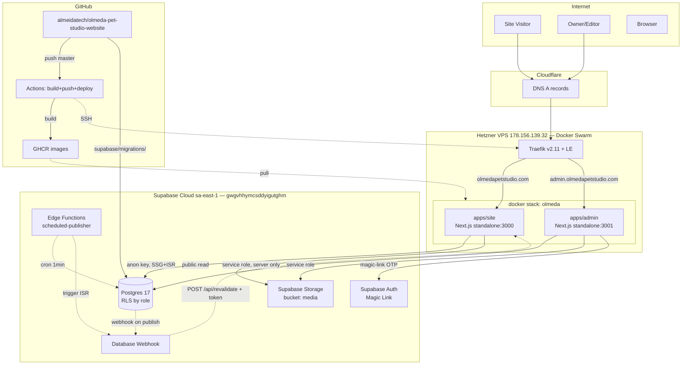
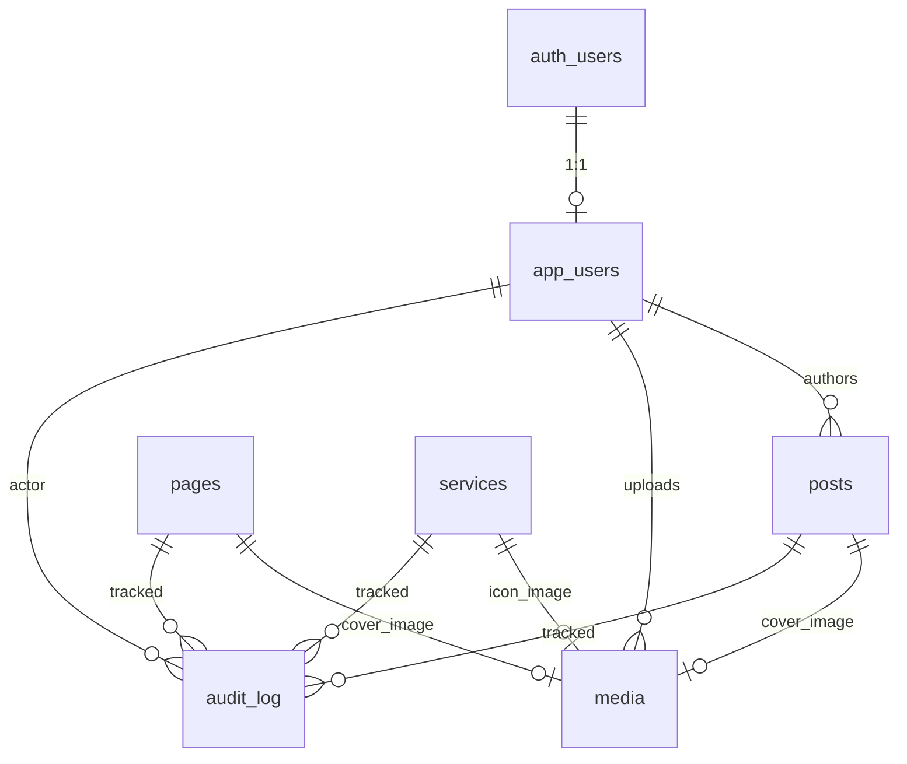
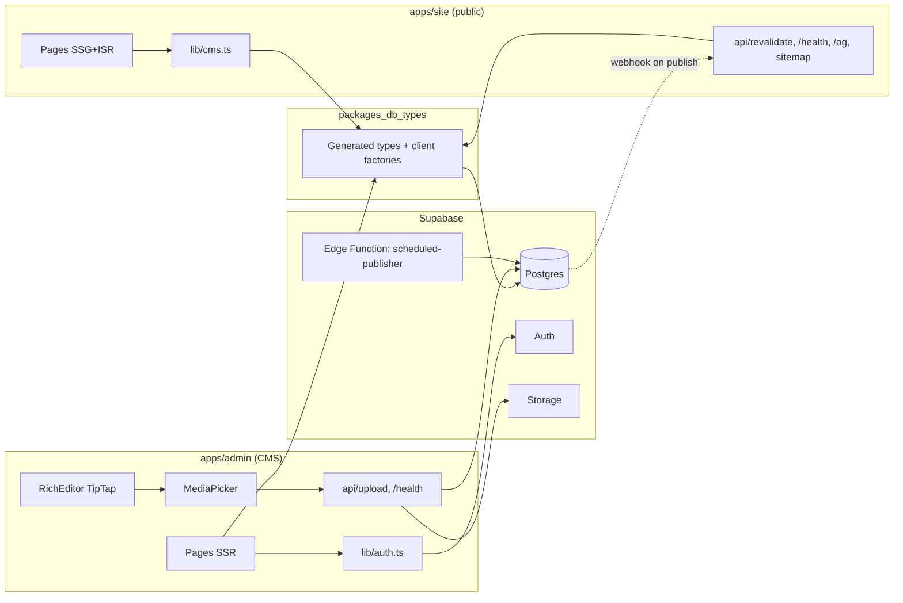
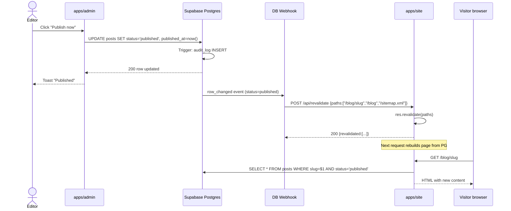
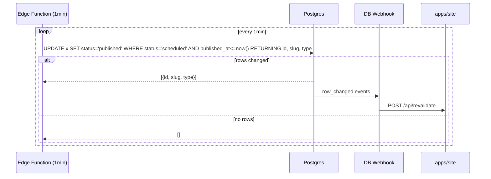
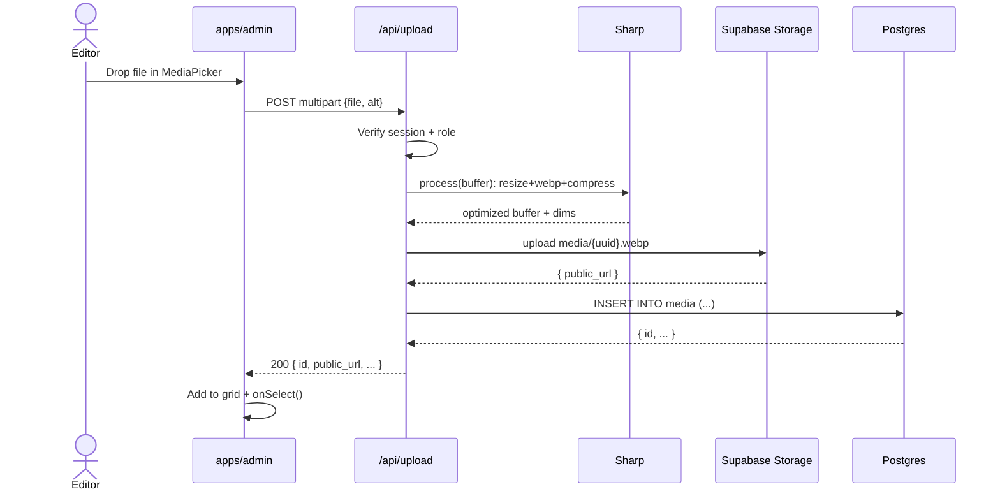

# Olmeda Pet Studio — Fullstack Architecture Document

**Status:** Draft v1 (Phase 1.4 — Architect output)
**Date:** 2026-05-23
**Author:** @architect (Aria) — derived from PRD + front-end-spec + project-brief + discovery
**Mode:** YOLO

---

## 1. Introduction

Este documento descreve a arquitetura fullstack para o **Olmeda Pet Studio Website + CMS**: dois apps Next.js (`apps/site` público + `apps/admin` interno) operando contra um único Supabase Cloud Postgres, deployados em Docker Swarm 1-node (Hetzner) atrás de Traefik, com CI/CD via GitHub Actions → GHCR. Decisões deste doc são vinculantes para a Phase 3 (SDC). Onde decisões competem com o PRD, este doc tem precedência técnica e o PRD deve ser atualizado.

### 1.1 Starter Template / Existing Project

**Brownfield-extension.** Repo existente `github.com/almeidatech/olmeda-pet-studio-website` (Next.js 14 + TypeScript + MDX) sem starter monorepo. Refactor para Turborepo é Story 1.1. Sem starter externo — patterns vêm de projetos irmãos da casa: `aylas-site` (Traefik+Swarm), `mundodecici` (GHCR), `nicoletti-cigars` (Supabase+RLS+webhook ISR).

### 1.2 Change Log

| Date       | Version | Description                       | Author          |
| ---------- | ------- | --------------------------------- | --------------- |
| 2026-05-23 | 1.0     | Initial fullstack architecture    | @architect (Aria) |

---

## 2. High Level Architecture

### 2.1 Technical Summary

Arquitetura **dual-app Next.js Pages Router** consumindo um Supabase Cloud Postgres compartilhado, deployada como dois serviços Docker independentes em **Swarm 1-node** atrás de Traefik com Let's Encrypt. Frontend público (`apps/site`) usa SSG + ISR on-demand acionado por **webhook Postgres → /api/revalidate** para publish→live ≤30s. Admin (`apps/admin`) é SPA-like server-rendered com Supabase Auth magic-link e gating via RLS por role + checks server-side. Storage de mídia via Supabase Storage bucket público; processamento de imagem inline no upload via API route Node Sharp. Monorepo Turborepo + pnpm compartilha `packages/db-types` (Supabase generated TS types) entre apps. CI via GitHub Actions matrix [site, admin] → GHCR → SSH deploy + `docker stack deploy`. Achievement direto dos goals PRD: low-cost (infra reaproveitada), low-latency (ISR + VPS sa-east-friendly), low-friction edit (Supabase Auth + TipTap).

### 2.2 Platform and Infrastructure Choice

**Platform:** Hetzner VPS (existing) + Supabase Cloud (existing) + GitHub (existing) — **zero novos providers**.
**Key Services:**
- **Compute:** Hetzner CX series VPS `178.156.139.32` (Debian 13, Docker 29.2.1, Swarm leader)
- **Backend-as-Service:** Supabase Cloud project `gwgvhhymcsddyigutghm` (Postgres 17, Auth, Storage, Database Webhooks, Edge Functions) — region `sa-east-1`
- **Reverse Proxy/TLS:** Traefik v2.11 (já no VPS) + Let's Encrypt
- **Registry:** GHCR `ghcr.io/olmedatech/*`
- **CI/CD:** GitHub Actions
- **DNS:** Cloudflare (DNS-only para HTTP-01 ACME)

**Deployment Host and Regions:**
- Compute: Hetzner Germany (single node).
- DB: Supabase São Paulo (`sa-east-1`).
- Latência Hetzner→Supabase ~210ms ida-volta (acceptable; queries são read-heavy + cacheable via ISR).

**Rationale para NÃO ir Vercel:** infra Hetzner já paga e operada; sem lock-in; Traefik+Swarm pattern reusado de aylas-site reduz risco operacional; custo marginal zero.

### 2.3 Repository Structure

**Structure:** Monorepo Turborepo + pnpm workspaces (single repo `github.com/almeidatech/olmeda-pet-studio-website`).

```
olmeda-petstudio/
├── apps/
│   ├── site/                 # Next.js public site
│   │   ├── src/
│   │   ├── public/
│   │   ├── Dockerfile
│   │   └── package.json
│   └── admin/                # Next.js CMS
│       ├── src/
│       ├── public/
│       ├── Dockerfile
│       └── package.json
├── packages/
│   ├── db-types/             # Generated Supabase TS types + shared client factory
│   └── ui-tokens/            # (opcional Phase 2) shared CSS vars from design system
├── supabase/
│   ├── migrations/           # SQL migrations, auto-applied via Git integration
│   └── seed.sql              # optional seed for local dev
├── scripts/
│   ├── seed-from-mdx.ts      # one-shot MDX→DB migrator
│   └── smoke.sh              # post-deploy smoke
├── infra/
│   └── swarm/
│       └── olmeda.yaml       # Docker Swarm stack file
├── .github/
│   └── workflows/
│       └── deploy.yml        # build + push + deploy matrix [site, admin]
├── docs/                     # PRD, architecture, stories, guides
├── design/                   # IMMUTABLE source-of-truth HTML/CSS
├── .aiox/                    # AIOX config + reports (committed except runtime files)
├── turbo.json
├── pnpm-workspace.yaml
└── package.json              # root workspace
```

### 2.4 High Level Architecture Diagram



### 2.5 Architectural Patterns

- **JAMstack-ish via ISR:** SSG + on-demand revalidation — combina performance estática com freshness sob demanda. _Rationale:_ atende NFR2 (LCP) e NFR4 (publish→live <30s) sem CDN externo.
- **BaaS-heavy (Supabase como backbone):** Auth + DB + Storage + Webhooks + Edge Functions de um único provider. _Rationale:_ reduz superficie operacional, evita stitching de N serviços, RLS substitui camada de authz custom.
- **Service-role isolation:** admin é a única superfície com service-role key; site usa só anon. _Rationale:_ NFR8 — minimiza blast radius de leak.
- **Webhook-driven cache invalidation:** Postgres webhook → revalidate endpoint, em vez de polling ou TTL agressivo. _Rationale:_ baixa latência + baixo custo de queries desnecessárias.
- **Trigger-based audit log:** SECURITY DEFINER triggers em todas as tabelas write — fonte única de verdade, impossível bypass pela aplicação. _Rationale:_ FR9 + compliance trail confiável.
- **Monorepo single-deploy-pipeline:** matrix build, deploys atômicos quando schema muda. _Rationale:_ evita esquemas dessincronizados entre site e admin.

---

## 3. Tech Stack

| Category               | Technology                              | Version       | Purpose                                      | Rationale                                                       |
| ---------------------- | --------------------------------------- | ------------- | -------------------------------------------- | --------------------------------------------------------------- |
| Frontend Language      | TypeScript                              | 5.4+          | Type safety em ambos apps                    | Padrão equipe; types compartilhados via packages                |
| Frontend Framework     | Next.js                                 | 14.x          | SSR/SSG/ISR/API routes                       | Já em uso no site; Pages Router para compat com migração       |
| UI Component Library   | `amandaalmeidda/olmeda-design-system`   | latest        | Tokens + primitives                          | Source-of-truth visual; coesão site↔admin                       |
| State Management       | React Context + SWR                     | 18 / 2.x      | Auth context + data fetching cache           | Suficiente para escopo CMS; sem Redux/Zustand overhead          |
| Backend Language       | TypeScript (Node)                       | 24.x          | API routes Next.js + scripts                 | Single language stack                                           |
| Backend Framework      | Next.js API routes + Supabase Edge Fn   | n/a           | API auth, revalidate, image proc, cron       | Sem framework de backend separado; Supabase Edge para cron     |
| API Style              | REST (Next.js routes) + Supabase JS SDK | n/a           | CMS reads via SDK; mutations via SDK         | Sem GraphQL — overhead injustificado                            |
| Database               | Postgres                                | 17.6.1        | OLTP + RLS                                   | Supabase managed; ACID + JSONB para audit diffs                 |
| Cache                  | Next.js ISR + browser HTTP cache        | n/a           | Static pages cache; revalidate on-demand     | Sem Redis no MVP                                                |
| File Storage           | Supabase Storage                        | latest        | Imagens uploads (bucket `media` público)     | Native integration; CDN-edge included                           |
| Authentication         | Supabase Auth (magic-link OTP)          | latest        | Admin login                                  | Zero senha, baixo onboarding overhead                           |
| Frontend Testing       | Vitest + React Testing Library          | 1.x / 14.x    | Unit + component                             | Vitest mais rápido que Jest; padrão moderno                     |
| Backend Testing        | Vitest + supabase local                 | 1.x           | Integration com DB real                      | `supabase start` para integration tests; sem mock de DB        |
| E2E Testing            | Manual smoke (Phase 1) → Playwright (Phase 2) | n/a       | Smoke checklist documentado                  | Evita complexidade até admin estabilizar                        |
| Build Tool             | Turborepo                               | 2.x           | Task orchestration + cache                   | Cache local + remote; padrão monorepo moderno                  |
| Bundler                | Next.js / Webpack 5                     | built-in      | Next bundling                                | Default Next                                                    |
| IaC Tool               | Docker Swarm stack file                 | compose 3.8   | `infra/swarm/olmeda.yaml`                    | Pattern de aylas-site; sem Terraform/Pulumi no MVP             |
| CI/CD                  | GitHub Actions                          | n/a           | Build matrix + deploy SSH                    | Já integrado ao repo                                            |
| Monitoring             | Traefik access logs + Supabase logs     | n/a           | Logs centralizados                           | MVP: stdout + Supabase dashboard; adicionar Plausible Phase 2 |
| Logging                | Next.js console + pino (opcional)       | latest        | JSON logs em prod                            | Capturados por Docker `json-file` driver                        |
| CSS Framework          | Tokens via design system + CSS Modules  | n/a           | Sem Tailwind no MVP                          | Consistência com site `/design`; eventual Tailwind Phase 2     |
| Editor                 | TipTap                                  | 2.x           | Rich-text WordPress-parity                   | Confirmado PRD §4.4                                             |
| Image processing       | sharp                                   | 0.33+         | Resize/WEBP no upload                        | Node nativo, performance OK; vide ADR-005                       |
| Package Manager        | pnpm                                    | 10.x          | Monorepo                                     | Já em uso, mais eficiente que npm                              |

---

## 4. Data Models

### 4.1 Conceptual Model



### 4.2 Core Entities

#### app_users
- `id UUID PK` (matches `auth.users.id`)
- `email TEXT NOT NULL UNIQUE`
- `name TEXT`
- `role app_role NOT NULL DEFAULT 'viewer'` — enum `admin|editor|viewer`
- `active BOOLEAN NOT NULL DEFAULT true`
- `created_at`, `updated_at`

**Validation:** email format checked at insert; `role` constrained by enum.

**Relationships:** 1:1 com `auth.users`; FK referenced by `posts.author_id`, `media.uploaded_by`, `audit_log.actor_id`.

#### posts
- `id UUID PK DEFAULT gen_random_uuid()`
- `slug TEXT NOT NULL UNIQUE`
- `title TEXT NOT NULL`
- `excerpt TEXT`
- `body_md TEXT`
- `body_html TEXT`
- `category TEXT`
- `tags TEXT[] DEFAULT '{}'`
- `cover_image_id UUID REFERENCES media(id) ON DELETE SET NULL`
- `status content_status NOT NULL DEFAULT 'draft'` — enum `draft|scheduled|published|archived`
- `published_at TIMESTAMPTZ`
- `author_id UUID REFERENCES app_users(id) ON DELETE SET NULL`
- `created_at`, `updated_at`

**Indexes:** `(slug)` unique, `(status, published_at DESC)`, `gin(tags)`, `(category, status)`.

#### pages
- `id UUID PK`
- `slug TEXT UNIQUE`
- `title TEXT NOT NULL`
- `body_md`, `body_html`
- `meta JSONB DEFAULT '{}'` — `{ "title": "...", "description": "...", "og_image_id": uuid }`
- `cover_image_id UUID REFERENCES media(id)`
- `status content_status`
- `published_at TIMESTAMPTZ`
- timestamps

#### services
- `id UUID PK`
- `slug TEXT UNIQUE`
- `title TEXT NOT NULL`
- `summary TEXT`
- `body_md`, `body_html`
- `price_tier TEXT` — enum-like string (`starter|standard|premium`)
- `icon TEXT` — icon name or media_id
- `order_index INT NOT NULL DEFAULT 100`
- `status content_status`, `published_at`
- timestamps

#### media
- `id UUID PK`
- `storage_path TEXT NOT NULL UNIQUE`  — caminho no bucket `media`
- `public_url TEXT` — gerado on insert
- `alt TEXT`
- `mime TEXT`
- `width_px INT`, `height_px INT`
- `size_bytes INT`
- `uploaded_by UUID REFERENCES app_users(id)`
- `created_at`

#### audit_log
- `id BIGINT GENERATED ALWAYS AS IDENTITY PK`
- `actor_id UUID REFERENCES app_users(id) ON DELETE SET NULL`
- `action audit_action NOT NULL` — enum `insert|update|delete`
- `entity_type TEXT NOT NULL` — `posts|pages|services|media|app_users`
- `entity_id UUID NOT NULL`
- `diff JSONB` — `{ "before": {...}, "after": {...} }`
- `created_at TIMESTAMPTZ NOT NULL DEFAULT now()`

**Indexes:** `(entity_type, entity_id, created_at DESC)`, `(actor_id, created_at DESC)`, BRIN em `created_at` para retention scans.

**Partitioning:** mensal por `created_at` (RANGE) — vide **ADR-001**.

### 4.3 Enums

```sql
CREATE TYPE app_role AS ENUM ('admin', 'editor', 'viewer');
CREATE TYPE content_status AS ENUM ('draft', 'scheduled', 'published', 'archived');
CREATE TYPE audit_action AS ENUM ('insert', 'update', 'delete');
```

---

## 5. API Specification

API surface é minimal — maioria das operações via **Supabase JS SDK** (REST autogen). Apenas 3 endpoints REST customizados:

### 5.1 `POST /api/revalidate` (apps/site)

**Purpose:** invalidação on-demand de páginas ISR.

**Headers:**
- `x-revalidate-token: <secret>` (constant-time compare vs `process.env.REVALIDATE_TOKEN`)

**Body:**
```json
{ "paths": ["/blog/welcome-to-olmeda", "/blog", "/sitemap.xml"] }
```

**Response 200:**
```json
{ "revalidated": ["/blog/welcome-to-olmeda", "/blog", "/sitemap.xml"], "now": 1716475200 }
```

**Errors:** 401 (token inválido), 400 (body inválido), 500 (revalidate falhou — retorna paths que falharam).

### 5.2 `GET /api/health` (both apps)

**Purpose:** healthcheck pro Traefik + smoke pós-deploy.

**Response 200:**
```json
{ "status": "ok", "commit": "abc1234", "uptime_seconds": 1234, "supabase_reachable": true }
```

Verifica reachability do Supabase com query trivial (`select 1`) cached 30s.

### 5.3 `POST /api/upload` (apps/admin)

**Purpose:** upload + processamento de imagem.

**Headers:** cookie de sessão Supabase (server reads + verifies role).

**Body:** `multipart/form-data` com campo `file` + `alt` opcional.

**Flow:**
1. Verify session via supabase-server.
2. Verify role in `app_users` is admin/editor.
3. Stream upload to memory buffer (limit 5MB).
4. Process via `sharp`: resize >1920 → 1920 max, convert to webp (quality 82).
5. Upload processed buffer to Supabase Storage `media/{uuid}.webp`.
6. INSERT row em `media`.
7. Return `{ id, public_url, width_px, height_px, size_bytes }`.

**Errors:** 401 (no session), 403 (wrong role), 413 (too large), 415 (unsupported type), 500 (processing failure).

---

## 6. Components

### 6.1 apps/site
- **Pages:** home, sobre, serviços (index+slug), blog (index+slug), contato.
- **lib/cms.ts:** server-only Supabase client + query functions.
- **lib/supabase-anon.ts:** factory pra anon client.
- **api/revalidate.ts:** webhook endpoint.
- **api/health.ts:** healthcheck.
- **api/og/[type]/[slug].tsx:** OG image generator (`@vercel/og`).
- **pages/sitemap.xml.ts:** sitemap dinâmico.
- **next.config.js:** `output: 'standalone'`, image domains.

### 6.2 apps/admin
- **Pages:** `/login`, `/auth/callback`, `/dashboard`, `/posts` (list + `/[id]`), `/pages`, `/services`, `/media`, `/users`, `/audit`.
- **components/Layout/Sidebar.tsx**, `TopBar.tsx`, `Breadcrumb.tsx`.
- **components/Editor/RichEditor.tsx** — TipTap wrapper.
- **components/Media/MediaPicker.tsx, MediaGrid.tsx**.
- **components/Table/DataTable.tsx** — generic paginated table.
- **components/Modal/ConfirmDialog.tsx, FormDialog.tsx**.
- **lib/supabase-server.ts** — service-role client factory; only used in API routes / getServerSideProps.
- **lib/supabase-browser.ts** — anon client for client components.
- **lib/auth.ts** — `useCurrentUser`, `withAuth` HOC, `getServerAuth`.
- **api/upload.ts** — image upload + processing.
- **api/health.ts**.
- **middleware.ts** — auth redirect.

### 6.3 packages/db-types
- **database.types.ts** — `supabase gen types typescript` output (committed).
- **index.ts** — re-exports + `createServerClient(url, key)` + `createBrowserClient(url, anonKey)` factories typed.

### 6.4 Supabase Edge Functions
- **scheduled-publisher** (vide ADR-004): cron 1-min, promove `scheduled → published`.

### 6.5 Component Diagram



---

## 7. External APIs

Nenhuma API externa de terceiros consumida no MVP. Supabase é o único backend. Cloudflare apenas DNS, sem API calls.

**Phase 2 candidates:** Anthropic API (AI drafts), Plausible (analytics), Resend (transactional email).

---

## 8. Core Workflows

### 8.1 Publish Post (sequence)



### 8.2 Scheduled Publish (cron)



### 8.3 Upload Image



---

## 9. Database Schema

Migration `supabase/migrations/00000000000001_init.sql` (esquema completo):

```sql
-- Extensions
CREATE EXTENSION IF NOT EXISTS pgcrypto;

-- Enums
CREATE TYPE app_role AS ENUM ('admin', 'editor', 'viewer');
CREATE TYPE content_status AS ENUM ('draft', 'scheduled', 'published', 'archived');
CREATE TYPE audit_action AS ENUM ('insert', 'update', 'delete');

-- Updated-at trigger fn
CREATE OR REPLACE FUNCTION public.set_updated_at()
RETURNS trigger LANGUAGE plpgsql AS $$
BEGIN
  NEW.updated_at = now();
  RETURN NEW;
END $$;

-- app_users
CREATE TABLE public.app_users (
  id UUID PRIMARY KEY REFERENCES auth.users(id) ON DELETE CASCADE,
  email TEXT NOT NULL UNIQUE,
  name TEXT,
  role app_role NOT NULL DEFAULT 'viewer',
  active BOOLEAN NOT NULL DEFAULT true,
  created_at TIMESTAMPTZ NOT NULL DEFAULT now(),
  updated_at TIMESTAMPTZ NOT NULL DEFAULT now()
);
CREATE TRIGGER app_users_updated_at BEFORE UPDATE ON public.app_users
  FOR EACH ROW EXECUTE FUNCTION public.set_updated_at();

-- media (declared before posts/pages/services for FK)
CREATE TABLE public.media (
  id UUID PRIMARY KEY DEFAULT gen_random_uuid(),
  storage_path TEXT NOT NULL UNIQUE,
  public_url TEXT NOT NULL,
  alt TEXT,
  mime TEXT NOT NULL,
  width_px INT,
  height_px INT,
  size_bytes INT NOT NULL,
  uploaded_by UUID REFERENCES public.app_users(id) ON DELETE SET NULL,
  created_at TIMESTAMPTZ NOT NULL DEFAULT now()
);

-- posts
CREATE TABLE public.posts (
  id UUID PRIMARY KEY DEFAULT gen_random_uuid(),
  slug TEXT NOT NULL UNIQUE,
  title TEXT NOT NULL,
  excerpt TEXT,
  body_md TEXT,
  body_html TEXT,
  category TEXT,
  tags TEXT[] NOT NULL DEFAULT '{}',
  cover_image_id UUID REFERENCES public.media(id) ON DELETE SET NULL,
  status content_status NOT NULL DEFAULT 'draft',
  published_at TIMESTAMPTZ,
  author_id UUID REFERENCES public.app_users(id) ON DELETE SET NULL,
  created_at TIMESTAMPTZ NOT NULL DEFAULT now(),
  updated_at TIMESTAMPTZ NOT NULL DEFAULT now()
);
CREATE INDEX posts_status_published_idx ON public.posts (status, published_at DESC);
CREATE INDEX posts_tags_gin ON public.posts USING gin(tags);
CREATE INDEX posts_category_status_idx ON public.posts (category, status);
CREATE TRIGGER posts_updated_at BEFORE UPDATE ON public.posts
  FOR EACH ROW EXECUTE FUNCTION public.set_updated_at();

-- pages
CREATE TABLE public.pages (
  id UUID PRIMARY KEY DEFAULT gen_random_uuid(),
  slug TEXT NOT NULL UNIQUE,
  title TEXT NOT NULL,
  body_md TEXT,
  body_html TEXT,
  meta JSONB NOT NULL DEFAULT '{}'::jsonb,
  cover_image_id UUID REFERENCES public.media(id) ON DELETE SET NULL,
  status content_status NOT NULL DEFAULT 'draft',
  published_at TIMESTAMPTZ,
  created_at TIMESTAMPTZ NOT NULL DEFAULT now(),
  updated_at TIMESTAMPTZ NOT NULL DEFAULT now()
);
CREATE INDEX pages_status_published_idx ON public.pages (status, published_at DESC);
CREATE TRIGGER pages_updated_at BEFORE UPDATE ON public.pages
  FOR EACH ROW EXECUTE FUNCTION public.set_updated_at();

-- services
CREATE TABLE public.services (
  id UUID PRIMARY KEY DEFAULT gen_random_uuid(),
  slug TEXT NOT NULL UNIQUE,
  title TEXT NOT NULL,
  summary TEXT,
  body_md TEXT,
  body_html TEXT,
  price_tier TEXT,
  icon TEXT,
  order_index INT NOT NULL DEFAULT 100,
  status content_status NOT NULL DEFAULT 'draft',
  published_at TIMESTAMPTZ,
  created_at TIMESTAMPTZ NOT NULL DEFAULT now(),
  updated_at TIMESTAMPTZ NOT NULL DEFAULT now()
);
CREATE INDEX services_order_idx ON public.services (order_index);
CREATE INDEX services_status_published_idx ON public.services (status, published_at DESC);
CREATE TRIGGER services_updated_at BEFORE UPDATE ON public.services
  FOR EACH ROW EXECUTE FUNCTION public.set_updated_at();

-- audit_log (partitioned by month)
CREATE TABLE public.audit_log (
  id BIGINT GENERATED ALWAYS AS IDENTITY,
  actor_id UUID REFERENCES public.app_users(id) ON DELETE SET NULL,
  action audit_action NOT NULL,
  entity_type TEXT NOT NULL,
  entity_id UUID NOT NULL,
  diff JSONB,
  created_at TIMESTAMPTZ NOT NULL DEFAULT now(),
  PRIMARY KEY (id, created_at)
) PARTITION BY RANGE (created_at);

-- Initial monthly partitions (3 ahead created via cron in Phase 2; manual for MVP)
CREATE TABLE public.audit_log_2026_05 PARTITION OF public.audit_log
  FOR VALUES FROM ('2026-05-01') TO ('2026-06-01');
CREATE TABLE public.audit_log_2026_06 PARTITION OF public.audit_log
  FOR VALUES FROM ('2026-06-01') TO ('2026-07-01');
-- (script creates next 6 months ahead; cleanup at 13 months — ADR-001)

CREATE INDEX audit_log_entity_idx ON public.audit_log (entity_type, entity_id, created_at DESC);
CREATE INDEX audit_log_actor_idx ON public.audit_log (actor_id, created_at DESC);

-- Audit trigger function (SECURITY DEFINER bypasses RLS for inserts)
CREATE OR REPLACE FUNCTION public.fn_audit_log()
RETURNS trigger LANGUAGE plpgsql SECURITY DEFINER AS $$
DECLARE
  v_actor UUID := auth.uid();
  v_diff JSONB;
BEGIN
  IF TG_OP = 'INSERT' THEN
    v_diff := jsonb_build_object('after', to_jsonb(NEW));
    INSERT INTO public.audit_log (actor_id, action, entity_type, entity_id, diff)
      VALUES (v_actor, 'insert', TG_TABLE_NAME, NEW.id, v_diff);
    RETURN NEW;
  ELSIF TG_OP = 'UPDATE' THEN
    v_diff := jsonb_build_object('before', to_jsonb(OLD), 'after', to_jsonb(NEW));
    INSERT INTO public.audit_log (actor_id, action, entity_type, entity_id, diff)
      VALUES (v_actor, 'update', TG_TABLE_NAME, NEW.id, v_diff);
    RETURN NEW;
  ELSIF TG_OP = 'DELETE' THEN
    v_diff := jsonb_build_object('before', to_jsonb(OLD));
    INSERT INTO public.audit_log (actor_id, action, entity_type, entity_id, diff)
      VALUES (v_actor, 'delete', TG_TABLE_NAME, OLD.id, v_diff);
    RETURN OLD;
  END IF;
  RETURN NULL;
END $$;

CREATE TRIGGER posts_audit AFTER INSERT OR UPDATE OR DELETE ON public.posts
  FOR EACH ROW EXECUTE FUNCTION public.fn_audit_log();
CREATE TRIGGER pages_audit AFTER INSERT OR UPDATE OR DELETE ON public.pages
  FOR EACH ROW EXECUTE FUNCTION public.fn_audit_log();
CREATE TRIGGER services_audit AFTER INSERT OR UPDATE OR DELETE ON public.services
  FOR EACH ROW EXECUTE FUNCTION public.fn_audit_log();
CREATE TRIGGER media_audit AFTER INSERT OR UPDATE OR DELETE ON public.media
  FOR EACH ROW EXECUTE FUNCTION public.fn_audit_log();
CREATE TRIGGER app_users_audit AFTER INSERT OR UPDATE OR DELETE ON public.app_users
  FOR EACH ROW EXECUTE FUNCTION public.fn_audit_log();

-- Helper: is current user admin/editor?
CREATE OR REPLACE FUNCTION public.current_user_can_write()
RETURNS BOOLEAN LANGUAGE sql STABLE AS $$
  SELECT EXISTS (
    SELECT 1 FROM public.app_users
    WHERE id = auth.uid() AND active = true AND role IN ('admin','editor')
  );
$$;

CREATE OR REPLACE FUNCTION public.current_user_is_admin()
RETURNS BOOLEAN LANGUAGE sql STABLE AS $$
  SELECT EXISTS (
    SELECT 1 FROM public.app_users
    WHERE id = auth.uid() AND active = true AND role = 'admin'
  );
$$;

-- Enable RLS
ALTER TABLE public.app_users ENABLE ROW LEVEL SECURITY;
ALTER TABLE public.posts ENABLE ROW LEVEL SECURITY;
ALTER TABLE public.pages ENABLE ROW LEVEL SECURITY;
ALTER TABLE public.services ENABLE ROW LEVEL SECURITY;
ALTER TABLE public.media ENABLE ROW LEVEL SECURITY;
ALTER TABLE public.audit_log ENABLE ROW LEVEL SECURITY;

-- Public read of published content
CREATE POLICY posts_anon_read ON public.posts FOR SELECT
  USING (status = 'published' AND published_at <= now());
CREATE POLICY pages_anon_read ON public.pages FOR SELECT
  USING (status = 'published' AND published_at <= now());
CREATE POLICY services_anon_read ON public.services FOR SELECT
  USING (status = 'published' AND published_at <= now());
CREATE POLICY media_anon_read ON public.media FOR SELECT USING (true);

-- Authenticated writes (admin/editor)
CREATE POLICY posts_write ON public.posts FOR ALL
  USING (public.current_user_can_write()) WITH CHECK (public.current_user_can_write());
CREATE POLICY pages_write ON public.pages FOR ALL
  USING (public.current_user_can_write()) WITH CHECK (public.current_user_can_write());
CREATE POLICY services_write ON public.services FOR ALL
  USING (public.current_user_can_write()) WITH CHECK (public.current_user_can_write());
CREATE POLICY media_write ON public.media FOR ALL
  USING (public.current_user_can_write()) WITH CHECK (public.current_user_can_write());

-- app_users: admin manages all; user reads self
CREATE POLICY app_users_self_read ON public.app_users FOR SELECT
  USING (id = auth.uid() OR public.current_user_is_admin());
CREATE POLICY app_users_admin_write ON public.app_users FOR ALL
  USING (public.current_user_is_admin()) WITH CHECK (public.current_user_is_admin());

-- audit_log: admin reads, nobody writes (only trigger via SECURITY DEFINER)
CREATE POLICY audit_log_admin_read ON public.audit_log FOR SELECT
  USING (public.current_user_is_admin());

-- Seed initial owner (TODO before Story 1.2 execution: confirm <OWNER_EMAIL>)
INSERT INTO public.app_users (id, email, name, role, active)
  SELECT id, email, COALESCE(raw_user_meta_data->>'name','Owner'), 'admin', true
  FROM auth.users WHERE email = '<OWNER_EMAIL>'
  ON CONFLICT (id) DO UPDATE SET role = 'admin', active = true;
-- If <OWNER_EMAIL> auth.users row doesn't yet exist (owner never logged in), this NO-OPs.
-- A re-sync migration (00000000000003_owner_seed.sql) runs after first owner login.
```

**Note:** seed do owner depende do account já existir em `auth.users`. Story 3.3.1 ajusta o email real ou usa `INSERT ... ON CONFLICT` quando Amanda fizer primeiro login.

---

## 10. Frontend Architecture

### 10.1 Routing (Next.js Pages Router)

**apps/site:**
```
/                 (SSG, revalidate 60s + on-demand)
/sobre
/servicos         (SSG)
/servicos/[slug]  (SSG getStaticPaths + revalidate)
/blog             (SSG)
/blog/[slug]      (SSG)
/contato
/api/revalidate   (POST)
/api/health
/api/og/[type]/[slug]
/sitemap.xml
/robots.txt
```

**apps/admin:**
```
/                 (server redirect by auth → /login or /dashboard)
/login
/auth/callback
/dashboard        (SSR)
/posts            (SSR, with paginated SWR client refresh)
/posts/[id]       (SSR)
/pages, /pages/[id]
/services, /services/[id]
/media
/users            (admin-only, server check)
/audit            (admin-only)
/api/upload       (POST)
/api/health
middleware.ts     (auth redirect)
```

### 10.2 State Management

- **Auth context** (`<AuthContext>`): provides `{ user, role, supabase, signOut }` from `_app.tsx`.
- **SWR** for data fetching with auto-revalidate + optimistic mutations.
- **No global store** (Redux/Zustand). Local state em forms via `useState` + `react-hook-form`.

### 10.3 Auth Flow Implementation

Admin usa `@supabase/ssr` para sessão em cookies HttpOnly. Server-side checks em `getServerSideProps` (page-level) e `middleware.ts` (route-level redirect).

```ts
// lib/auth.ts (apps/admin)
import { createServerClient } from '@supabase/ssr';

export async function getServerAuth(ctx: GetServerSidePropsContext) {
  const supabase = createServerClient(URL, ANON_KEY, {
    cookies: { /* read/write from ctx.req/res */ }
  });
  const { data: { session } } = await supabase.auth.getSession();
  if (!session) return { redirect: { destination: '/login', permanent: false } };
  const { data: appUser } = await supabase
    .from('app_users').select('*').eq('id', session.user.id).single();
  if (!appUser?.active) return { redirect: { destination: '/login?denied=1' } };
  return { props: { session, appUser } };
}
```

### 10.4 Component Hierarchy (admin example)

```
<AppShell>
  <Sidebar />
  <main>
    <TopBar breadcrumb saveStatus actions />
    <PageContent>
      <PostEditor>
        <TitleInput />
        <RichEditor />  ← TipTap
        <SidebarTabs>
          <ContentTab>
            <SlugInput />
            <CategorySelect />
            <TagsInput />
            <MediaPicker for="cover" />
          </ContentTab>
          <SeoTab />
          <SettingsTab>
            <StatusDropdown />
            <SchedulePicker />
          </SettingsTab>
        </SidebarTabs>
      </PostEditor>
    </PageContent>
  </main>
  <ToastContainer />
</AppShell>
```

---

## 11. Backend Architecture

### 11.1 Service Boundaries

- **apps/site backend:** Next.js API routes (`/api/*`) — stateless, executando dentro do mesmo container.
- **apps/admin backend:** Next.js API routes — service-role consumer; image processing.
- **Supabase Edge Function `scheduled-publisher`:** standalone, executa em runtime Deno na infra Supabase.

### 11.2 Auth & Session (admin)

- Magic-link via `supabase.auth.signInWithOtp({ email, options: { emailRedirectTo: 'https://admin.olmedapetstudio.com/auth/callback' } })`.
- Callback handler valida `code` (PKCE flow), seta cookies HttpOnly via `@supabase/ssr`.
- Middleware redireciona unauthenticated → `/login`.
- Logout via `supabase.auth.signOut()` + redirect.

### 11.3 Image Pipeline

Vide **ADR-005**. Resumo:

1. Client POST multipart → `/api/upload`.
2. Server valida session+role.
3. `sharp(buf).rotate().resize({ width: 1920, withoutEnlargement: true }).webp({ quality: 82 }).toBuffer()`.
4. Upload buffer to `media/{uuid}.webp` via `supabaseAdmin.storage.from('media').upload(...)`.
5. INSERT row.

### 11.4 Cron / Scheduled Publishing

Vide **ADR-004**. Supabase Edge Function `scheduled-publisher` + pg_cron schedule a cada minuto.

---

## 12. Unified Project Structure

(vide §2.3 acima — completo)

---

## 13. Development Workflow

### 13.1 Local Setup

```bash
# clone
git clone https://github.com/almeidatech/olmeda-pet-studio-website
cd olmeda-pet-studio-website

# install
pnpm install

# env
cp .env.example .env.local  # fill SUPABASE_URL, ANON_KEY, SERVICE_ROLE_KEY, REVALIDATE_TOKEN

# generate types
pnpm generate-types

# seed (one-time after schema applied)
pnpm seed

# dev
pnpm dev                           # turbo runs both apps
pnpm --filter @olmeda/site dev     # site only :3000
pnpm --filter @olmeda/admin dev    # admin only :3001
```

### 13.2 Environment Vars

| Var                              | Site | Admin | Notes                              |
| -------------------------------- | ---- | ----- | ---------------------------------- |
| `NEXT_PUBLIC_SUPABASE_URL`       | ✅   | ✅    | Public; both apps                  |
| `NEXT_PUBLIC_SUPABASE_ANON_KEY`  | ✅   | ✅    | Public; both apps                  |
| `SUPABASE_SERVICE_ROLE_KEY`      | ❌   | ✅    | **NEVER bundled to site**          |
| `REVALIDATE_TOKEN`               | ✅   | —     | Shared secret with webhook         |
| `WEBHOOK_SIGNING_SECRET`         | ✅   | —     | Optional HMAC verify (Phase 2)    |
| `GIT_SHA`                        | ✅   | ✅    | Injected at build for /health      |
| `NEXT_PUBLIC_SITE_URL`           | ✅   | ✅    | Canonical URLs                     |

---

## 14. Deployment Architecture

### 14.1 Strategy

**Push-to-master → auto-deploy.** Sem ambientes intermediários (staging) no MVP. Test via local + smoke pós-deploy. Adicionar staging Phase 2 quando admin tiver usuários externos.

### 14.2 CI/CD Pipeline (`.github/workflows/deploy.yml`)

```yaml
name: deploy
on:
  push: { branches: [master] }
  workflow_dispatch:
concurrency:
  group: deploy
  cancel-in-progress: false
jobs:
  build:
    strategy:
      matrix:
        app: [site, admin]
    runs-on: ubuntu-latest
    permissions: { contents: read, packages: write }
    steps:
      - uses: actions/checkout@v4
      - uses: docker/setup-buildx-action@v3
      - uses: docker/login-action@v3
        with: { registry: ghcr.io, username: ${{ github.actor }}, password: ${{ secrets.GITHUB_TOKEN }} }
      - uses: docker/build-push-action@v5
        with:
          context: .
          file: apps/${{ matrix.app }}/Dockerfile
          push: true
          tags: |
            ghcr.io/olmedatech/olmeda-${{ matrix.app }}:latest
            ghcr.io/olmedatech/olmeda-${{ matrix.app }}:${{ github.sha }}
          build-args: |
            GIT_SHA=${{ github.sha }}
            GH_DESIGN_SYSTEM_TOKEN=${{ secrets.GH_DESIGN_SYSTEM_TOKEN }}
          cache-from: type=gha
          cache-to: type=gha,mode=max
  deploy:
    needs: build
    runs-on: ubuntu-latest
    steps:
      - uses: actions/checkout@v4
      - name: Copy stack file
        uses: appleboy/scp-action@v0.1.7
        with:
          host: ${{ secrets.VPS_HOST }}
          username: ${{ secrets.VPS_USER }}
          key: ${{ secrets.VPS_SSH_KEY }}
          source: infra/swarm/olmeda.yaml
          target: /srv/olmeda/
      - name: Deploy stack
        uses: appleboy/ssh-action@v1.0.3
        with:
          host: ${{ secrets.VPS_HOST }}
          username: ${{ secrets.VPS_USER }}
          key: ${{ secrets.VPS_SSH_KEY }}
          script: |
            cd /srv/olmeda
            echo ${{ secrets.GITHUB_TOKEN }} | docker login ghcr.io -u ${{ github.actor }} --password-stdin
            docker pull ghcr.io/olmedatech/olmeda-site:latest
            docker pull ghcr.io/olmedatech/olmeda-admin:latest
            docker stack deploy -c olmeda.yaml olmeda --with-registry-auth --prune
      - name: Smoke
        run: |
          sleep 30
          curl -fsS https://olmedapetstudio.com/api/health || exit 1
          curl -fsS https://admin.olmedapetstudio.com/api/health || exit 1
```

### 14.3 Swarm Stack (`infra/swarm/olmeda.yaml`)

```yaml
version: "3.8"
networks:
  olmedaNet: { external: true }

services:
  site:
    image: ghcr.io/olmedatech/olmeda-site:latest
    networks: [olmedaNet]
    environment:
      NEXT_PUBLIC_SUPABASE_URL: ${SUPABASE_URL}
      NEXT_PUBLIC_SUPABASE_ANON_KEY: ${SUPABASE_ANON_KEY}
      REVALIDATE_TOKEN: ${REVALIDATE_TOKEN}
      NEXT_PUBLIC_SITE_URL: https://olmedapetstudio.com
    deploy:
      replicas: 1
      update_config: { order: start-first, parallelism: 1, failure_action: rollback }
      restart_policy: { condition: any, delay: 5s, max_attempts: 3 }
      labels:
        - traefik.enable=true
        - traefik.docker.network=olmedaNet
        - traefik.http.routers.olmeda-site-http.entrypoints=web
        - traefik.http.routers.olmeda-site-http.rule=Host(`olmedapetstudio.com`) || Host(`www.olmedapetstudio.com`)
        - traefik.http.routers.olmeda-site-http.middlewares=olmeda-site-redirect-https
        - traefik.http.middlewares.olmeda-site-redirect-https.redirectscheme.scheme=https
        - traefik.http.middlewares.olmeda-site-redirect-https.redirectscheme.permanent=true
        - traefik.http.routers.olmeda-site-https.entrypoints=websecure
        - traefik.http.routers.olmeda-site-https.rule=Host(`olmedapetstudio.com`) || Host(`www.olmedapetstudio.com`)
        - traefik.http.routers.olmeda-site-https.tls=true
        - traefik.http.routers.olmeda-site-https.tls.certresolver=letsencryptresolver
        - traefik.http.routers.olmeda-site-https.middlewares=olmeda-site-www-redirect
        - traefik.http.middlewares.olmeda-site-www-redirect.redirectregex.regex=^https://www\.olmedapetstudio\.com/(.*)
        - traefik.http.middlewares.olmeda-site-www-redirect.redirectregex.replacement=https://olmedapetstudio.com/$${1}
        - traefik.http.middlewares.olmeda-site-www-redirect.redirectregex.permanent=true
        - traefik.http.services.olmeda-site.loadbalancer.server.port=3000
        - traefik.http.services.olmeda-site.loadbalancer.healthcheck.path=/api/health
        - traefik.http.services.olmeda-site.loadbalancer.healthcheck.interval=30s

  admin:
    image: ghcr.io/olmedatech/olmeda-admin:latest
    networks: [olmedaNet]
    environment:
      NEXT_PUBLIC_SUPABASE_URL: ${SUPABASE_URL}
      NEXT_PUBLIC_SUPABASE_ANON_KEY: ${SUPABASE_ANON_KEY}
      SUPABASE_SERVICE_ROLE_KEY: ${SUPABASE_SERVICE_ROLE_KEY}
      NEXT_PUBLIC_SITE_URL: https://admin.olmedapetstudio.com
    deploy:
      replicas: 1
      update_config: { order: start-first, parallelism: 1, failure_action: rollback }
      restart_policy: { condition: any, delay: 5s, max_attempts: 3 }
      labels:
        - traefik.enable=true
        - traefik.docker.network=olmedaNet
        - traefik.http.routers.olmeda-admin-http.entrypoints=web
        - traefik.http.routers.olmeda-admin-http.rule=Host(`admin.olmedapetstudio.com`)
        - traefik.http.routers.olmeda-admin-http.middlewares=olmeda-admin-redirect-https
        - traefik.http.middlewares.olmeda-admin-redirect-https.redirectscheme.scheme=https
        - traefik.http.middlewares.olmeda-admin-redirect-https.redirectscheme.permanent=true
        - traefik.http.routers.olmeda-admin-https.entrypoints=websecure
        - traefik.http.routers.olmeda-admin-https.rule=Host(`admin.olmedapetstudio.com`)
        - traefik.http.routers.olmeda-admin-https.tls=true
        - traefik.http.routers.olmeda-admin-https.tls.certresolver=letsencryptresolver
        - traefik.http.services.olmeda-admin.loadbalancer.server.port=3001
        - traefik.http.services.olmeda-admin.loadbalancer.healthcheck.path=/api/health
        - traefik.http.services.olmeda-admin.loadbalancer.healthcheck.interval=30s
```

Secrets injetadas via env file no VPS (`/srv/olmeda/.env`, modo 0600).

---

## 15. Security & Performance

### 15.1 Security

- **Service-role isolation:** key só em `apps/admin` envs; runtime check no startup falha se var faltar/presente errado.
- **RLS as primary authz:** mesmo se app bug, RLS impede leitura/escrita não-autorizada.
- **Webhook auth:** constant-time compare de `x-revalidate-token`. Phase 2: HMAC signing via `WEBHOOK_SIGNING_SECRET` + nonce/timestamp.
- **HTTPS everywhere:** Traefik HTTP→HTTPS redirect; HSTS via middleware Traefik adicional.
- **Magic-link expiration:** Supabase default 1h, single-use.
- **Rate limiting:** Supabase Auth built-in (3 OTP/hour/email). `/api/upload` rate-limited via Edge middleware Phase 2.
- **CSP:** strict header em ambos apps (`default-src 'self'; img-src 'self' https://*.supabase.co data:; ...`).
- **Secrets:** GH Actions secrets + VPS env file 0600; nunca em git.
- **Dependency audit:** `pnpm audit` no CI; Dependabot weekly.
- **Sentry/error tracking:** Phase 2 (sem no MVP).

### 15.2 Performance

- **Site:** SSG + ISR; cache HIT em <50ms a partir Traefik.
- **Admin:** SSR; cold start <500ms (standalone Next).
- **Imagens:** WEBP 1920 max, q82 → ~150KB avg para hero shots.
- **Bundle:** dynamic import de TipTap + sharp; admin route bundle <300KB gzip target.
- **DB queries:** index review pré-launch; EXPLAIN ANALYZE de queries não-trivial.
- **Edge function cron:** payload mínimo; busy-wait < 200ms quando vazio.

---

## 16. Testing Strategy

### 16.1 Pyramid

```
        ┌─────────┐
        │  Smoke  │  Manual checklist (docs/qa/smoke-checklist.md)
        ├─────────┤
        │  Integ  │  Vitest + supabase local — fluxos publish/auth/upload
        ├─────────┤
        │  Unit   │  Vitest — funcs puras (slugify, markdown, helpers)
        └─────────┘
```

### 16.2 Test Organization

```
apps/site/
  src/
    lib/cms.ts
    lib/cms.test.ts
apps/admin/
  src/
    components/Editor/RichEditor.test.tsx
tests/
  integration/
    publish-flow.test.ts   # spin supabase local + test full flow
    auth-flow.test.ts
  fixtures/
    seed.sql
```

### 16.3 Quality Gates (pre-push)

- `pnpm lint` (eslint + prettier check)
- `pnpm typecheck` (tsc --noEmit per workspace)
- `pnpm test` (vitest run, unit only no CI; integration roda local)
- `pnpm build` (turbo build matrix)

---

## 17. Coding Standards

Detalhamento completo será sharded em `docs/architecture/coding-standards.md` (Phase 2 — @po shard). Resumo:

- **TypeScript strict** em ambos apps (`strict: true`, `noUncheckedIndexedAccess: true`).
- **ESLint** preset Next.js + `eslint-plugin-jsx-a11y` (a11y AA).
- **Prettier** default; 100 col line length.
- **No `any`** salvo justificado em comment `// eslint-disable-line @typescript-eslint/no-explicit-any`.
- **Server/Client boundary:** files terminados em `*.server.ts` só importáveis de server contexts; convention enforced via lint rule custom (Phase 2).
- **Error handling:** API routes retornam `{ error: { code, message } }` em failure; client trata com toasts.
- **Logging:** `console.error` no MVP; pino JSON Phase 2.
- **Commit msg:** Conventional Commits.

---

## 18. Architecture Decision Records (ADRs)

### ADR-001: Audit Log — Retention & Partitioning

**Status:** Accepted
**Context:** PRD NFR12 exige retenção mínima 1 ano de audit. Volume estimado: ~50-200 events/dia → ~70k/ano. Crescimento linear OK em Postgres standard table, mas particionamento facilita drop barato.

**Decision:**
- Particionar `audit_log` por mês via `PARTITION BY RANGE (created_at)`.
- Retenção: **13 meses** (current + 12 trailing).
- Cleanup via job mensal: `DROP TABLE audit_log_YYYY_MM` para partições >13 meses. Implementado como Supabase scheduled function (Phase 2 — manual no MVP).
- Pre-create de 6 partições futuras em script `scripts/audit-partitions.sql`, rodado quando faltarem ≤2 partições no horizonte.

**Consequences:**
- ✅ Cleanup rápido (DROP partition O(1)).
- ✅ Queries por `created_at` range usam partition pruning.
- ⚠️ Operacional: lembrar de criar partições futuras (alerta em monitoring Phase 2).
- ⚠️ FKs em tabelas particionadas têm restrições — `actor_id` como FK não bloqueia (ON DELETE SET NULL).

---

### ADR-002: Supabase Backup Strategy

**Status:** Accepted
**Context:** Supabase Free não oferece PITR. Plano Pro ($25/mo/project) oferece PITR 7 dias. PRD NFR14 deixa em aberto.

**Decision:**
- **MVP:** rely on Supabase **daily logical backup** (built-in Free tier — 1 backup/day, 7 days retention).
- **Adicionalmente:** GitHub Action semanal (`weekly-backup.yml`) faz `pg_dump` via Supabase pooler → encrypted artifact armazenado em S3-compat (MinIO já no VPS) com retenção 4 semanas.
- **Upgrade para Pro:** quando primeiro editor não-owner começar a usar admin (≥2 editores ativos). Custo justifica risco.

**Consequences:**
- ✅ Custo zero no MVP.
- ✅ Backup redundante via dump semanal local.
- ⚠️ RPO até 24h no MVP — aceito (volume baixo, recriação possível via discovery patterns).
- ⚠️ Cuidar de secrets do pooler no GH Actions.

---

### ADR-003: Magic-Link Email Transport

**Status:** Accepted
**Context:** Supabase Auth built-in usa transport interno (rate-limited 3 emails/hora, sender genérico, deliverability media). Para CMS interno com ≤5 logins/dia/user é suficiente.

**Decision:**
- **MVP:** Supabase built-in email transport.
- **Trigger para mudar:** se deliverability spam (Gmail/Outlook), OU se editor count >5, OU se branding (`from: noreply@olmedapetstudio.com`) for requisitado.
- **Migração planejada:** SMTP custom via **Resend** (mais simples que SES em volume baixo, $0 até 3k/mo). Edit Supabase project settings → SMTP custom. Sem code change.

**Consequences:**
- ✅ Zero setup no MVP.
- ⚠️ Sender é `noreply@mail.app.supabase.io` (não-branded) — anotar em onboarding doc.
- ⚠️ Rate limit pode incomodar em onboarding de batch users.

---

### ADR-004: Scheduled → Published Cron

**Status:** Accepted
**Context:** PRD FR8 exige scheduled publishing. Opções: (a) Supabase Edge Function + pg_cron, (b) view computada, (c) cron externo no VPS.

**Decision:** **Supabase Edge Function `scheduled-publisher` + pg_cron schedule '* * * * *'** (every minute).

```sql
-- pg_cron job (criado via Supabase dashboard ou migration)
SELECT cron.schedule(
  'promote-scheduled-content',
  '* * * * *',
  $$
    UPDATE public.posts SET status='published' WHERE status='scheduled' AND published_at<=now();
    UPDATE public.pages SET status='published' WHERE status='scheduled' AND published_at<=now();
    UPDATE public.services SET status='published' WHERE status='scheduled' AND published_at<=now();
  $$
);
```

UPDATE triggera webhook (mesma cadeia de publish manual), que invalida ISR no site. Sem Edge Function necessária se pg_cron sozinho funciona — vide simplification abaixo.

**Decision (refined):** **pg_cron only**, sem Edge Function. UPDATE em si dispara o webhook configurado em `posts/pages/services WHERE status='published'`.

**Consequences:**
- ✅ Implementação trivial — 1 SQL job, sem código.
- ✅ Latência ≤60s (precisão de minuto aceita por NFR4).
- ⚠️ Depende de pg_cron extension habilitada (default no Supabase).
- ⚠️ Se UPDATE em massa, webhook fires 1x/row — aceitável (≤10 promotions/min realista).

---

### ADR-005: Image Processing Pipeline

**Status:** Accepted
**Context:** PRD FR7 + NFR11 exigem upload + processamento. Opções: (a) Next.js API route com `sharp`, (b) Supabase Edge Function (Deno + WASM ImageMagick), (c) Supabase Storage built-in image transformation.

**Decision:** **Next.js API route em `apps/admin` com `sharp`**.

Razão:
- `sharp` é state-of-art em Node, performante.
- Roda no mesmo container do admin — sem cold start de Edge Function.
- Storage transformation do Supabase é leitura on-the-fly (não substitui write-time normalization que queremos para deduplicação de tamanho).
- Single-node Swarm — sem distributed concerns.

**Consequences:**
- ✅ Performance: ~150ms para imagem 4MB → WEBP 1920.
- ✅ Sem dependency externa.
- ⚠️ `sharp` precisa ser instalado com binary correto no Dockerfile (alpine: `apk add --no-cache vips`).
- ⚠️ Upload synchronous — UI bloqueia até retorno. UX OK pra MVP; async + progress Phase 2 se ≥10MB.

---

### ADR-006: Revalidate Token Rotation

**Status:** Accepted
**Context:** PRD §8.2 questão (6): como rotacionar `REVALIDATE_TOKEN` sem downtime.

**Decision:**
- Token longo (≥32 bytes random) gerado uma vez via `openssl rand -hex 32`.
- Armazenado em: (a) GH Actions secret `REVALIDATE_TOKEN`, (b) VPS `/srv/olmeda/.env`, (c) Supabase Webhook config (header value).
- **Rotation flow:**
  1. Generate new token.
  2. Update site env (deploy site with new token — site agora aceita NOVO).
  3. Site temporarily aceita **dois** tokens via env `REVALIDATE_TOKEN` (current) + `REVALIDATE_TOKEN_PREVIOUS` (old).
  4. Update Supabase webhook config (agora envia NOVO).
  5. Após 1 hora sem hits no old, remove `REVALIDATE_TOKEN_PREVIOUS`.
- **Frequency:** rotate anualmente OU sob suspeita de leak.
- Implementation: `validateToken()` checa contra ambos.

**Consequences:**
- ✅ Zero downtime na rotação.
- ⚠️ Adiciona complexidade mínima no validator.
- ⚠️ Requer redeploy em duas fases — documentar em runbook.

---

### ADR-007: Zero-Downtime Schema Migrations

**Status:** Accepted
**Context:** PRD §8.2 questão (7). Supabase Git integration aplica DDL automaticamente; site/admin running pode quebrar se DDL incompatível.

**Decision:** seguir **expand-then-contract pattern** estrito:

1. **Expand (migration N):** adicionar nova coluna `nullable` ou nova tabela. App ignora (usa old schema).
2. **Deploy app** (já lê/escreve old + opcionalmente new).
3. **Backfill data** se necessário (migration N+1).
4. **Cutover (migration N+2):** flip app code para usar new schema. Old caminho deletado.
5. **Contract (migration N+3):** drop coluna antiga, drop constraint, etc.

Regras adicionais:
- **NUNCA** em mesma migration: `ADD COLUMN NOT NULL` sem default; `DROP COLUMN` enquanto código usa; `RENAME` (use add+backfill+drop).
- Migrations sempre **reversíveis** ou com rollback documentado.
- `CREATE INDEX CONCURRENTLY` em tabelas grandes (>10k rows) — mas attention: Supabase Git integration roda em transaction; concurrent não funciona dentro de transaction. **Workaround:** usar Supabase Dashboard SQL editor ou separate migration runner pra concurrent indexes.

**Consequences:**
- ✅ Site e admin nunca veem schema "intermediário" inconsistente.
- ⚠️ Mais migrations por mudança (3-4 vs 1). Aceito por safety.
- ⚠️ Discipline humana — adicionar PR checklist Phase 2.

---

## 19. Checklist Results

_Preenchido pelo `@po` (Pax) na Phase 1.5._

---

## 20. Next Steps

1. @po (Pax) valida coerência cross-doc via `po-master-checklist`.
2. @po executa shard de PRD + arquitetura em `docs/prd/` e `docs/architecture/` para consumo do @sm.
3. @sm começa o SDC com Story 1.1 (Monorepo Refactor).
4. @architect disponível para refinamentos durante implementação se assumptions caírem.

— Aria, desenhando arquiteturas robustas 🏛️
